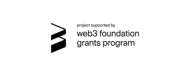

# cChannel-substrate

* [Overview](#overview)
* [Core Concepts](#core-concepts)
* [Release Features](#release-features)
* [Run Celer local testnet in Docker](#run-celer-local-testnet-in-docker)
* [Buidling and Testing celer-pay runtime module from source](#building-and-testing-celer-pay-runtime-module-from-source)

## Overview
CelerPay is a generalized payment network that supports efficient off-chain token transfer with the capbability to resolve arbitrary conditional dependency on on-chain verifiable states. This repo implements the CelerPay runtime module with substrate. It includes a collection of runtime module acting as the binding of core CelerPay abstractions and supporting modules. CeleryPay runtime module only specify the interaction logic of two peers. A network of payment channels can be built using these single-hop primitives and protocols.

To learn more about Celer state channel network, please refer to the [CelerCore technical documentation](https://www.celer.network/docs/celercore/channel/overview.html). More specifically, [this page](https://www.celer.network/docs/celercore/channel/pay_contracts.html) gives a detailed description of our smart contract design, structure, and API flows.

Celer state channel network is composed of Celer-pay Onchain runtime module and Celer-pay Offchain protocol. This repository is Celer-pay Onchain runtime module. Celer-pay Offchain protocol is not implemented yet. 

__WARNING__: This is a proof-of-concept prototype. This implementation is NOT ready for production use. 

## Core Concepts
* **Peers**: channel participants (only supports two-peer channel for now).
* **Simplex Channel**: a single-direction payment channel from one peer to the other peer.
* **Duplex Channel**: a bidirectional payment channel between peers including two independent simplex channels.
* **Simplex State**: a piece of data describing the state of a simplex channel.
* **Signed Simplex State**: Simplex State signed by channel participants, which serves as a bridge data structure between on-chain runtime module and off-chain communication protocols.
* **Condition**: data structure representing the basic unit of conditional dependency.
* **Transfer Function**: a higher-level abstraction of generalized state dependencies on a group of conditions.
* **Conditional Payment**: data structure representing a physical payment from payment source to payment destination.
* **Payment Source**: the address sends out a payment, namely the source of this payment route.
* **Payment Destination**: the address receives a payment, namely the destination of this payment route.
* **Vouched Conditional Payment Result**: the result of a conditional payment agreed by the payment source and payment destination.
* **PayRegistry**: a global registry which updates and records all payment results.
* **PayIdList**: data structure including a list of payment ids and a hash pointer to next PayIdList, which is used in Batch Multi-Payment Clearing.
* **Pool**: Pool enables the single-transaction channel opening feature of CelerPay

## Release Features
* **Native token Support**: users can specify polkadot native token to open an Substrate-based channel.
* **Generalized State Channel**: resolves conditional state dependency by relying on dependent virtual channels.
* **Fully Duplex Channel**: supports two independent simplex (single-direction) channels in a duplex channel, which makes off-chain communications much simpler and more efficient.
* **Boolean Condition Interface**: defines the condition that returns boolean value.
* **Boolean AND Resolution Logic**: resolves a group of conditions based on boolean AND logic.
* **Boolean OR Resolution Logic**: resolves a group of conditions based on boolean OR logic.
* **Numeric Condition Interface**: defines the condition that returns numeric value.
* **Numeric ADD Resolution Logic**: resolves a group of conditions based on numeric ADD logic.
* **Numeric MAX Resolution Logic**: resolves a group of conditions based on numeric MAX logic.
* **Numeric MIN Resolution Logic**: resolves a group of conditions based on numeric MIN logic.
* **Single-transaction Channel Opening**: opens channel with a single on-chain transaction through funds approval for native token.
* **Dynamic Withdraw**: withdraws fund before channel finalized as long as no peers disagree during challenge period.
* **Cooperative Dynamic Withdraw**: skips challenge period and withdraws fund before channel finalized when both peers reach an agreement.
* **Lightweight cooperative on-chain checkpoint**: support snapshotting transfer map of co-signed states on-chain.
* **Batch Multi-Channel Settlements**: intends to settle multiple channels in one batch with a single on-chain transaction.
* **Batch Multi-Payment Clearing**: clears *N* payments in one batch with a single on-chain transaction using PayIdList, which only requires O(1) on-chain storage and O(*n*/*N*) on-chain verifications to clear *n* payments.
* **Cooperative Settle**: skips challenge period and settles a channel when both peers reach an agreement.

## Run Celer local testnet in Docker

```
docker run -p 9944:9944 -p 9615:9615 thashimoto19980924/celer-network:0.8.8
````

## Building and Testing celer-pay runtime module from source
1. Fast Installation

Mac OS, Arch, or a Debian-based OS like Ubuntu

```
curl https://getsubstrate.io -sSf | bash -s -- --fast
```

Debian

```
sudo apt install -y cmake pkg-config libssl-dev git gcc build-essential clang libclang-dev
```

MacOS

```
brew install openssl cmake llvm
```

2. Rust Developer Environment

```
curl https://sh.rustup.rs -sSf | sh
```

```
rustup default stable
```

3. Wasm Compilation

```
rustup install nightly
rustup target add wasm32-unknown-unknown --toolchain nightly
rustup default stable
```

4. Install celer-pay runtime module
```
git clone git@github.com:celer-network/cChannel-substrate.git
```
5. Go to cChannel-substrate's root directory

6. Build celer-pay runtime moodule

```
cd ./pallets/celer-pay
cargo build --release
```

7. Test celer-pay runtime module

```
cargo test -p celer-pay-module
```




